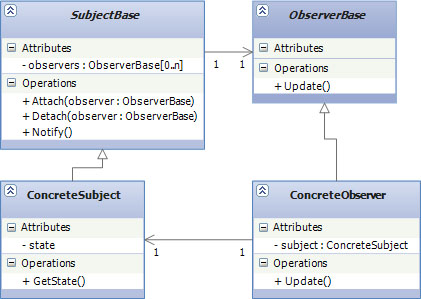

## Behavioral Design Patterns

### **Observer** ###

##### Мотивация
 Observer е модел дизайн, който определя връзката между обектите, така че когато се промени състоянието на даден обект, всички зависими обекти се актуализират автоматично. Този модел дава възможност за комуникация между обектите в свободно свързани начин.
##### Цел
Използвайки този модел дизайн ви се позволява да следите и да публикувате промените на даден обект. Когато настъпи промяна, другите обекти наречени "наблюдатели" могат автоматично да бъдат уведомени чрез извикване на един от техните методи.
"Обектите" държат референции към всички "наблюдатели", които трябва да бъдат уведомени, когато настъпят промени.
 
##### Приложение


##### Имплементация

```c#    
public abstract class CurrencyPair
    {
        private readonly List<ICurrencyObserver> observers = new List<ICurrencyObserver>();
        private readonly string code;
        private decimal price;

        protected CurrencyPair(string code, decimal price)
        {
            this.code = code;
            this.price = price;
        }

        public decimal Price
        {
            get
            {
                return this.price;
            }
            set
            {
                if (Math.Abs(this.price - value) > 0.0001M)
                {
                    this.price = value;
                    this.Notify();
                }
            }
        }

        public string Code
        {
            get
            {
                return this.code;
            }
        }

        public void Register(ICurrencyObserver observer)
        {
            if (!this.observers.Contains(observer))
            {
                this.observers.Add(observer);
            }
        }

        public void Unregister(ICurrencyObserver observer)
        {
            if (this.observers.Contains(observer))
            {
                this.observers.Remove(observer);
            }
        }

        public void Notify()
        {
            foreach (ICurrencyObserver observer in this.observers)
            {
                observer.Notify(this);
            }
        }
    }

public class EURUSDCurrencyPair : CurrencyPair
    {
        public EURUSDCurrencyPair(decimal initial)
            : base("EUR/USD", initial)
        {
        }
    }

public class GBPUSDCurrencyPair : CurrencyPair
    {
        public GBPUSDCurrencyPair(decimal initial)
            : base("GBP/USD", initial)
        {
        }
    }

public interface ICurrencyObserver
    {
        void Notify(CurrencyPair currencyPair);
    }

public class NikolayObserver : ICurrencyObserver
    {
        public void Notify(CurrencyPair currencyPair)
        {
            Console.WriteLine("Nikolay Notified of {0} " + "change to {1:0.0000}", currencyPair.Code, currencyPair.Price);
        }
    }

public class FXCMObserver : ICurrencyObserver
    {
        public void Notify(CurrencyPair currencyPair)
        {
            Console.WriteLine("FXCM Notified of {0} " + "change to {1:0.0000}", currencyPair.Code, currencyPair.Price);
        }
    }

public class Program
    {
        static void Main()
        {
            ICurrencyObserver niki = new NikolayObserver();
            ICurrencyObserver fxcm = new FXCMObserver();

            CurrencyPair gbpusd = new GBPUSDCurrencyPair(1.5583M);
            gbpusd.Register(niki);
            gbpusd.Register(fxcm);

            CurrencyPair eurusd = new EURUSDCurrencyPair(1.1423M);
            eurusd.Register(fxcm);

            gbpusd.Price = 1.5580M;
            gbpusd.Price = 1.5560M;
            eurusd.Price = 1.1534M;
        }
    }

```
##### Участници
SubjectBase

ConcreteSubject

ObserverBase

ConcreteObserver

##### Структура



